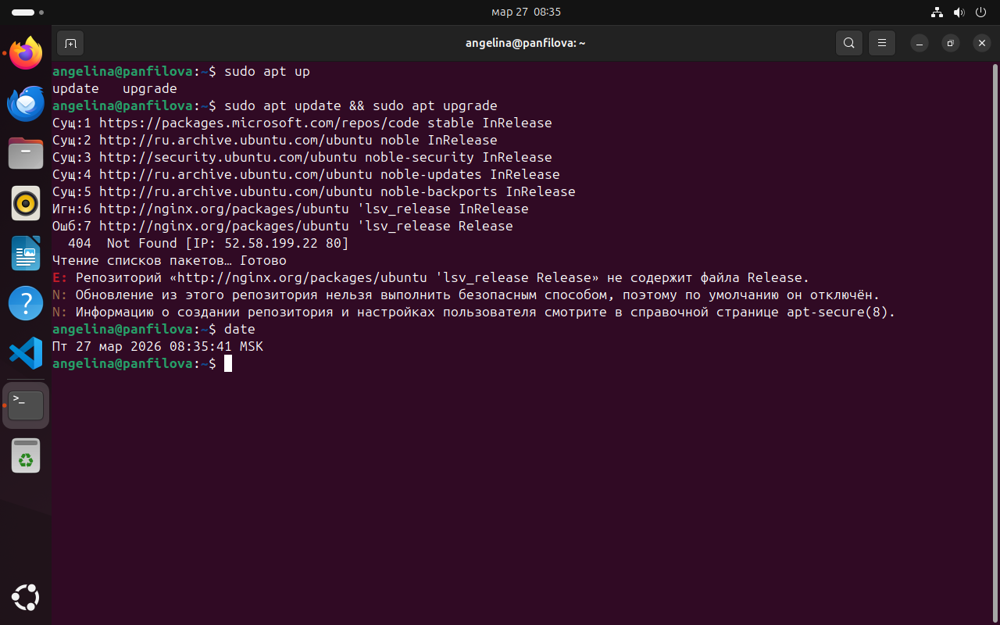
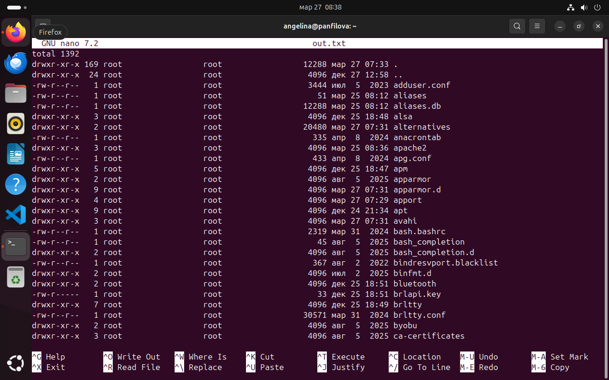
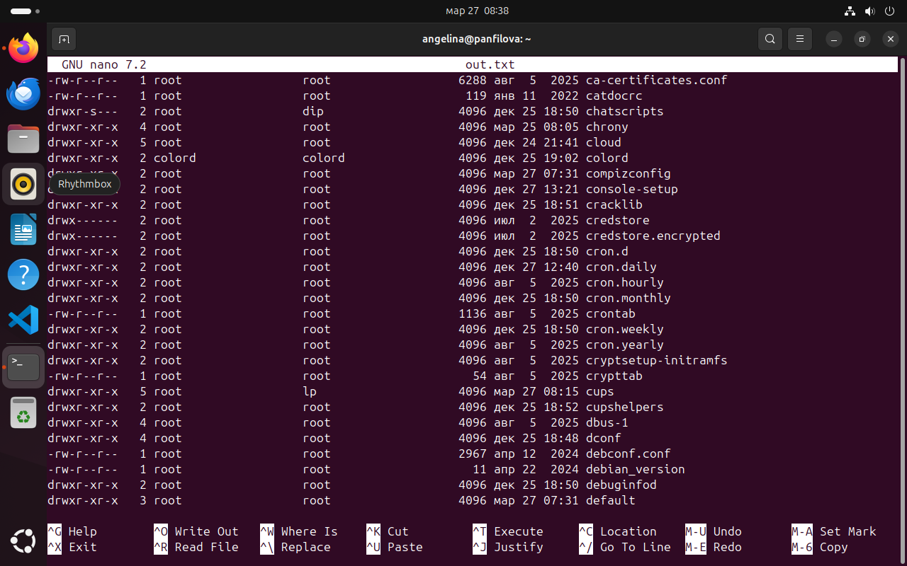
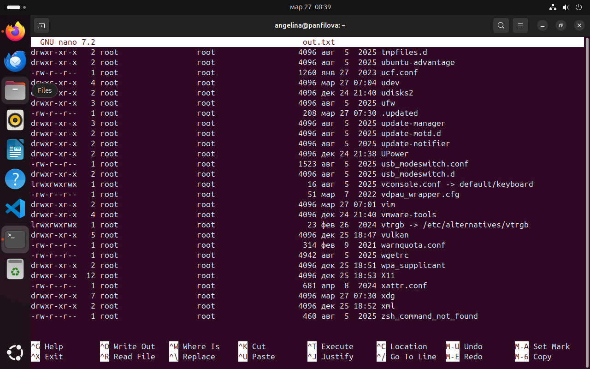
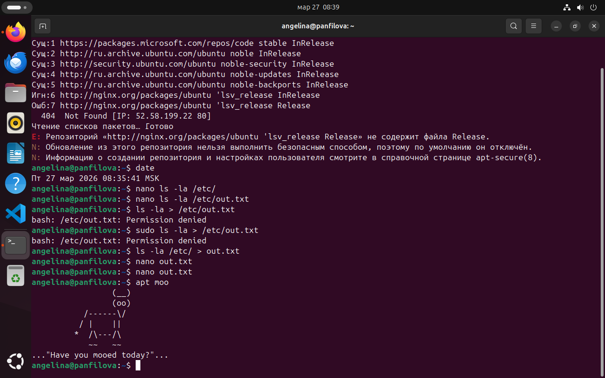
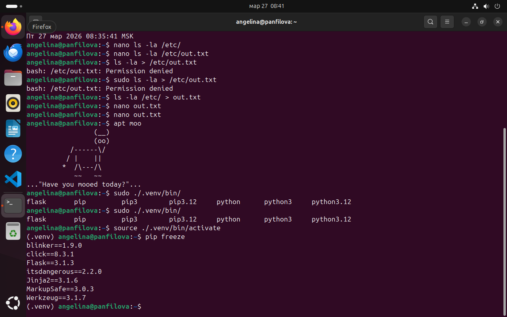
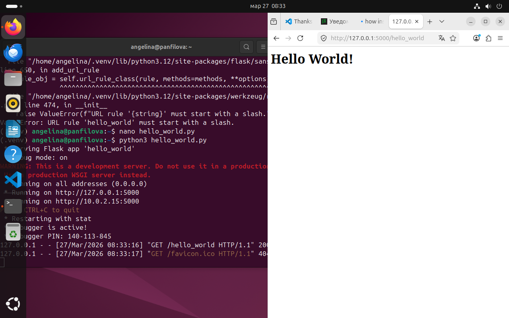

# Отчёт по первому практическому заданию
<!-- Студентка группы РИЗ-330916у Панфилова Ангелина Олеговна -->

> 1. update & upgrade
> - Обновление списка репозиториев Ubuntu с использованием sudo-привилегий
> - Запуск обновления системных пакетов в Ubuntu с отображением списка обновляемых компонентов.
> 
> 2. date +"%Y-%m-%d"
> - Вывод текущей даты в формате ГОД-МЕСЯЦ-ДЕНЬ через команду date.


На рисунке ниже изображено выполнение следующих условий, где видна мои фамилия и имя в качестве имени ВМ и логина пользователя.




> 3. nano ls -la /etc
> - Перенаправление вывода команды ls -la /etc в файл out.txt и просмотр его содержимого.

Ниже скрины вывода 
```bash
 ls -la /etc > out.txt
```







> 4. apt moo
> - Вывод ASCII-арта через команду apt moo.

Вывод команды ниже



> 5. pip install flask requests  (venv)
> - Создание виртуального окружения Python и установка фреймворка Flask с зависимостями.
> - Установка библиотеки requests и её зависимостей в виртуальное окружение Python.

Flask уже был установлен, поэтому отображу демонстрацию зависимостей.
Уточнение: они записаны в отдельный файл и установлены с помощью команды
```bash
pip install -r "название файла".txt
```




> 6. Hello world, теримнал, код
> - Создание простого веб-приложения на Flask с маршрутом, возвращающим HTML-страницу.
> - Запуск и отображение веб-приложения Flask с сообщением "Hello world!" в браузере.

На изображении ниже показала запуск приложения и вывод браузера


