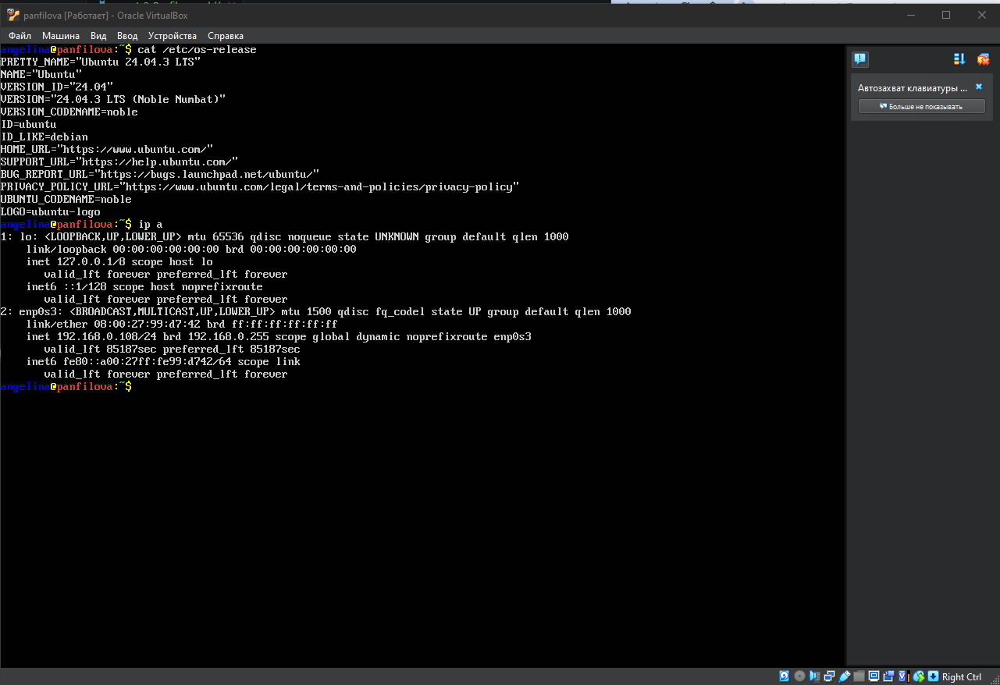
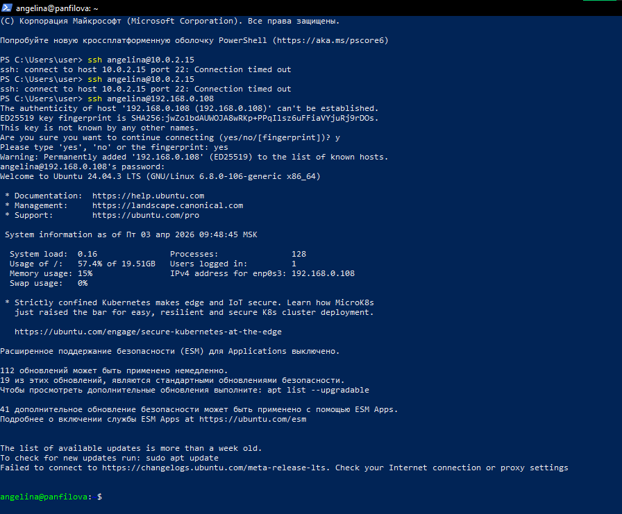
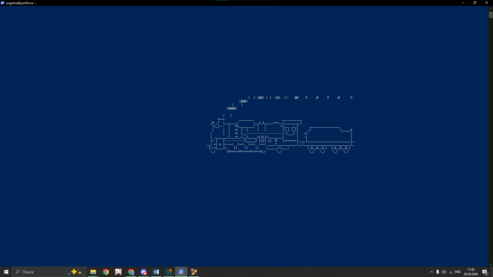
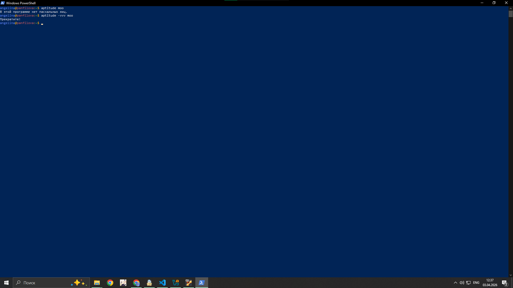
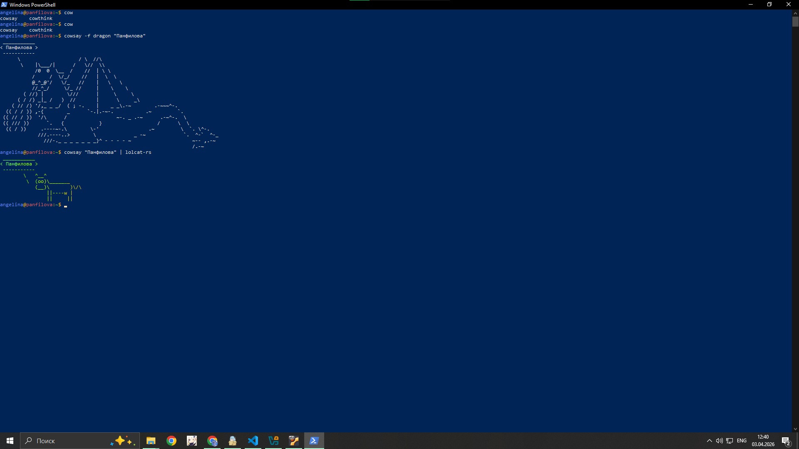
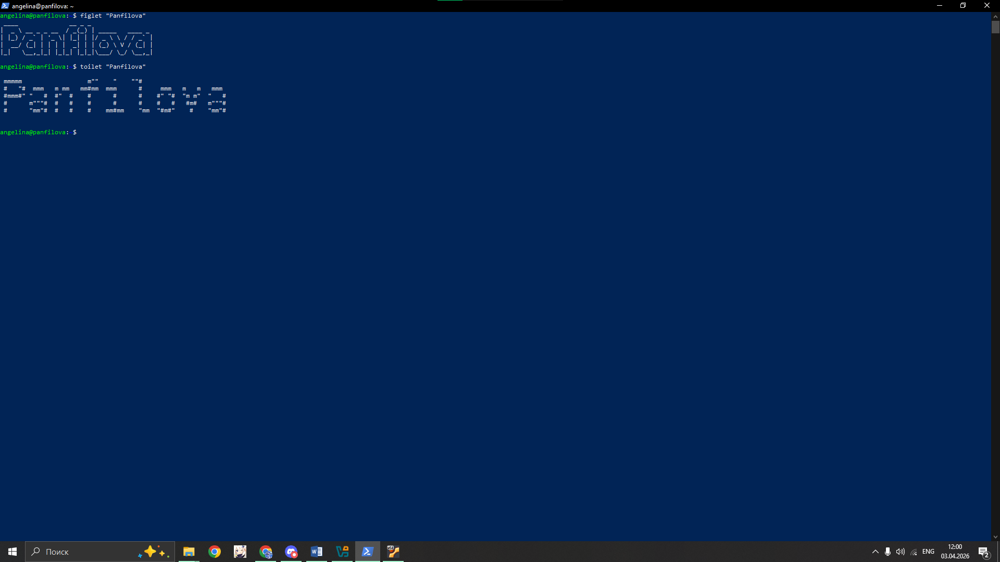
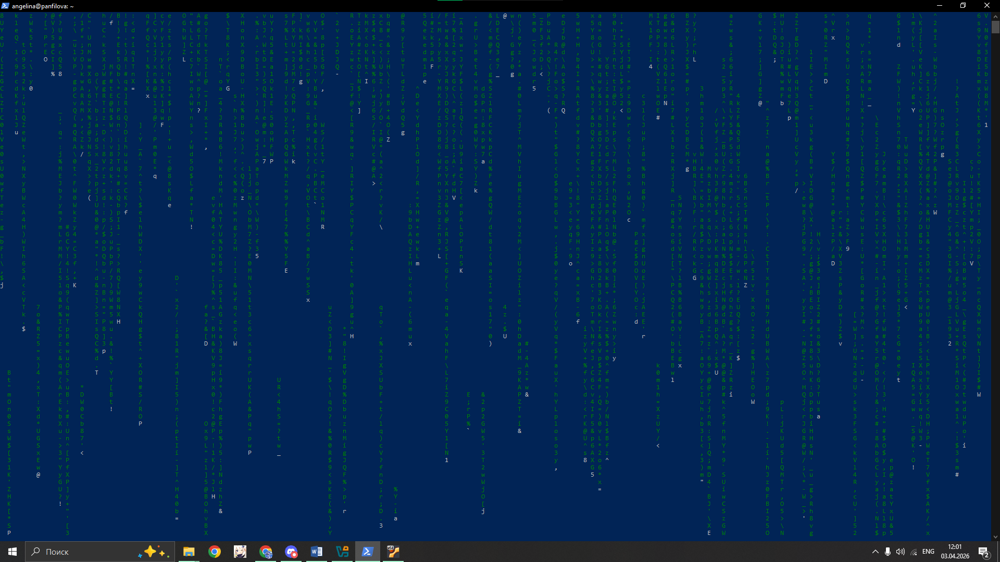
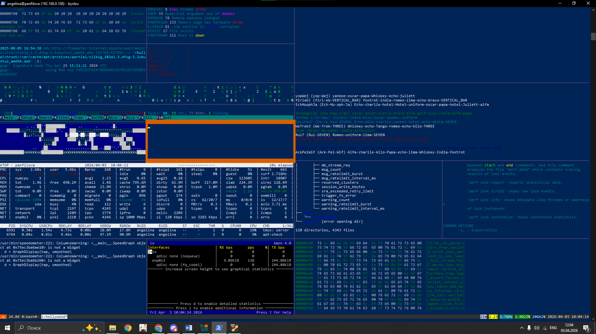
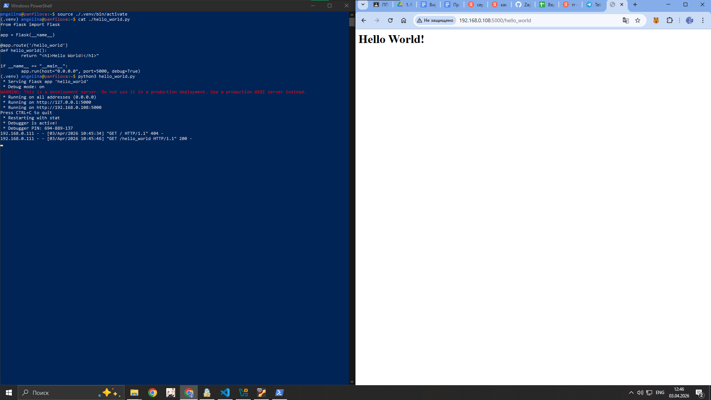

# Отчёт по второй практической работе

На виртуальной машине был развёрнут сервер c пользователем angelina и адресом 192.168.0.108
На рисунке ниже изображено информация о виртуальной машине и какой адрес ей принадлежит:



> 1. ssh -i but_server butakow@192.168.0.200
> - Подключение по ssh протоколу к удаленному серверу

На рисунке ниже видно подключение к удалённому серверу Ubuntu 24.04. Сначала адрес был 10.0.2.15, а потом изменён, чтоб адреса виртуальной машины и физического ПК находились в одной подсети.



> 2  sl
> - Обнаружение пасхалок

На рисунке ниже изображено выполнение команды `sl`, в ходе которой отрисовывается паровоз.



> 3  aptitude moo
> - Попытки обнаружить пасхалки в программе aptitude с различными флагами: moo, -moo, -vvv moo

На рисунке ниже изображено выполнение команд:
```bash
aptitude moo
aptitude -vvv moo
```



> 4  cowsay - Обнаружение пасхалок
> cowsay -f dragon "Фамилия"
> cowsay "Фамилия" | lolcat

На рисунке  ниже изображено выполнение команд:
```bash
cowsay -f dragon "Панфилова"
cowsay "Панфилова" | lolcat-rs
```



> 5  figlet "Фамилия"
> toilet "Фамилия"

На рисунке ниже изображено выполнение команд:
```bash
figlet "Panfilova"
toilet "Panfilova"
```
Взята латиница, так как кириллицу он не мог обработать корректно



> 6 cmatrix
> - эффект "матричного дождя"

На рисунке ниже изображено выполнение данной команды



> 7 hollywood
> sudo apt-add-repository ppa:hollywood/ppa
> sudo apt update
> sudo apt install hollywood
> - имитация бурной деятельности

На рисунке ниже изображено выполнение команды `hollywood`



> 8 развернуть веб-приложение "hello world" на сервере
> на скрине должны быть:
> - cat project3/app.py
> - запуск скрипта
> - web-браузер

На рисунке ниже видно содержание файла `heelo_world.py`, его запуск на сервере (через подключения по ssh) и открытый браузер по адресу `http://192.168.0.108:5000/hello_world` на физическом компютере



