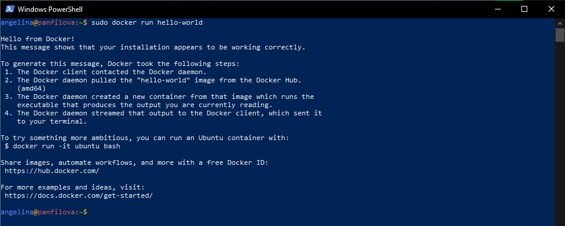
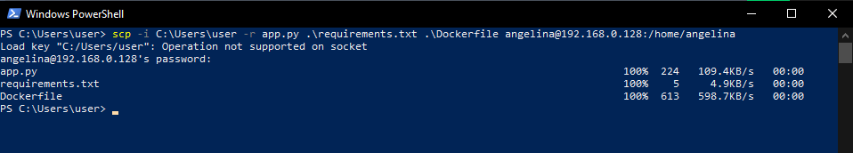
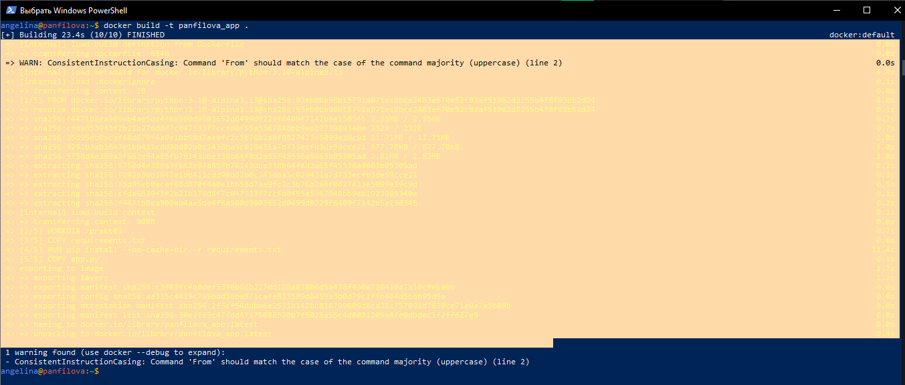
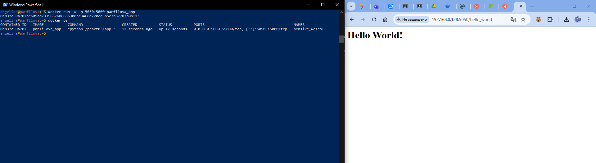
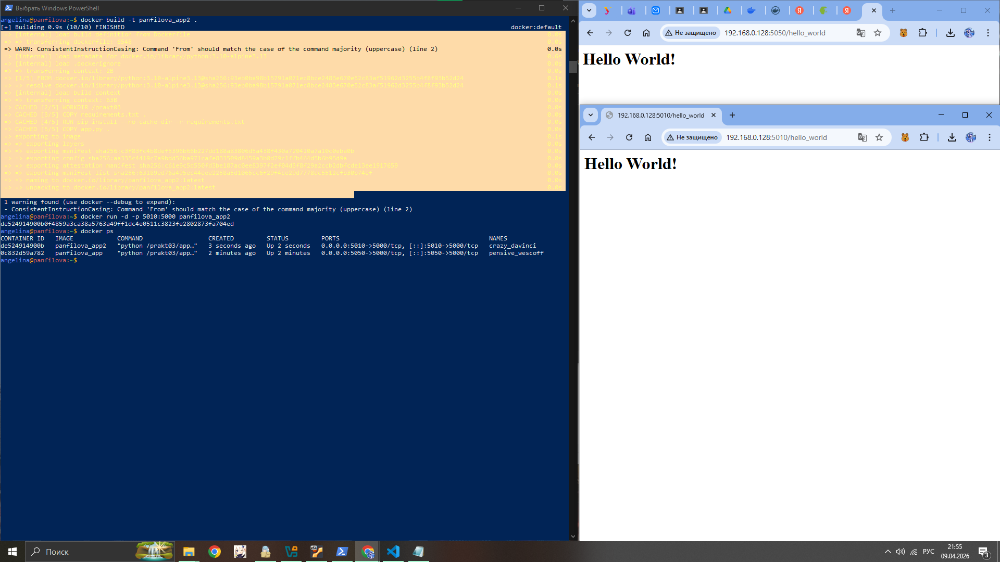

> 1 Консольный вывод запущенного Flask-приложения на сервере (http://IP_server:5000 запрос с clienta) с отображением "Hello World!" в браузере.

> 2. Успешный запуск контейнера Docker с образом "hello-world", который был автоматически загружен из репозитория и выполнен, с выводом подтверждающего сообщения и инструкций для дальнейшего использования.
> 
> sudo docker run hello-world

> 3. Запуск контейнера Docker "06kellyjac/nyancat"
> 
> docker run -it --rm 06kellyjac/nyancat

> 4. Синхронизация проектных файлов (app.py, Dockerfile и requirements.txt) между локальной Windows-средой и удаленным Ubuntu-сервером через SCP-протокол, что является типичным рабочим процессом для развертывания веб-приложений в распределенной среде разработки.
> 
> scp -i ~/but -r  app  butakow@192.168.1.200:/home/butakow/project2

> 5. Процесс сборки Docker-образа "фамилия_студента_app" на Ubuntu-сервере на основе базового образа
>
>Python 3.10-alpine3.13 с установкой необходимых зависимостей.
>docker build -t but_app
>
>Запуск контейнера "фамилия_студента_app" и окончательный результат работы в виде веб-страницы "Hello World!" в браузере по адресу IP_server:5000.
>
>docker run -p5050:5000 but_app python /app/app.py

> 6. Cборка образа glu_app"фамилия_студента_app2" на базе Python 3.10- alpine с необходимыми зависимостями, автоматический запуск контейнера и окончательный результат работы в виде веб-страницы "Hello World!" в браузере по адресу IP_server:5010.
>
> docker build -t but_app2
> docker run -p5010:5000 but_app2

> 7. Параллельное выполнение двух контейнеризированных Flask-приложений на Ubuntu-сервере.
>
>docker run -p5050:5000 but_app python /app/app.py
>docker run -p5010:5000 but_app2

